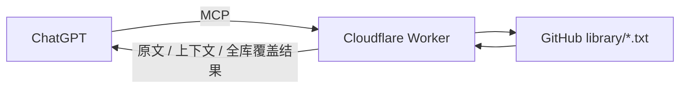

# Classics Counsel MCP / 典籍参谋

一个把中国古典典籍接入 ChatGPT 的自托管 MCP。

它不是“让古人替你做决定”，也不只是一个古籍关键词搜索器。它更适合在你面对现实中的选择、关系、工作、学习、风险、进退与判断时，从典籍中寻找**具体原文、历史案例和彼此不同的思想视角**，再由 ChatGPT 帮你比较这些材料与现实处境的相似处和差异。

> 核心目标：**让不同典籍真正参与思考，而不是只找一句最顺耳的古话。**

---

## 一个实际例子

用户：

> `@典籍参谋 从现有所有典籍里找“用人无疑与防人之心”两个不同方向的例子。`

典籍参谋会先做全库检索，再从不同典籍中挑选能形成对照的材料。例如：

- 《资治通鉴》：比较曹操与袁绍时，有“用人无疑，唯才所宜”的评价；
- 《史记》：刘邦在判断陈平可用后，给予大额授权，“恣所为，不问其出入”；
- 《韩非子》：齐桓公亲近易牙、竖刁等人的故事，提醒不要把异常讨好直接等同于忠诚；
- 《战国策》：“三人成虎”展示重复信息、群体意见如何影响判断；
- 《传习录》：提醒“一味不疑”与“事事猜忌”都可能走向极端。

最终不是替用户套一个古代答案，而是把不同路径放到同一张桌面上：

> **用人无疑**可以理解为“经判断后敢于授权”；  
> **防人之心**可以理解为“保留判断力，不因亲近、讨好、流言或既有信任而停止核实”。

更多示例见 [`docs/EXAMPLES.md`](docs/EXAMPLES.md)。

---

## 当前收录典籍

当前仓库的 `library/` 目录包含：

- 《史记》
- 《资治通鉴》
- 《战国策》
- 《论语》
- 《孟子》
- 《庄子》
- 《韩非子》
- 《传习录》
- 《孙子兵法》
- 《世说新语》

这些书不是写死在代码里。只要继续向 `library/` 上传新的 UTF-8 `.txt` 文件，插件就会自动发现并检索，无需修改核心代码。

典籍来源、版本与文本说明见 [`SOURCES.md`](SOURCES.md)。

---

## 工作原理



当前版本不再要求人工把古籍切成数据库段落，也不依赖 D1 作为正文存储。

一本新书的维护流程只有：

```text
下载/整理完整 TXT
      ↓
上传到 library/
      ↓
等待目录缓存刷新
      ↓
ChatGPT 可直接检索
```

---

## MCP 工具

### `list_books`
列出 `library/` 中当前可用的全部 `.txt` 典籍。

### `get_book_info`
查看一本书的文件名、大小、仓库路径和来源链接。

### `search_passages`
全文字面检索。

当没有指定具体书名时，工具会：

1. 先搜索当前全部典籍；
2. 返回每本书的命中统计；
3. 为每本有命中的书保留一条代表结果；
4. 再附加若干全库高排名结果。

这样可以避免“前几本书已经找到好例子，于是后面的书根本没机会参与”的问题。

### `get_passage`
根据 `search_passages` 返回的 `passage_ref` 展开命中段落及前后文。

---

## 适合怎么问

你不需要写复杂 Prompt。

如果当前 ChatGPT 需要从典籍中重新取数据，直接在消息里 @ 你的自定义 App，然后正常说你的问题即可，例如：

> `@典籍参谋 我最近很纠结，要不要把刚做完的项目发给朋友看。`

> `@典籍参谋 我很怕自己一犹豫就错过机会，但又怕冲动。`

> `@典籍参谋 从现有全部典籍里找“信任与防备”两个不同方向的案例。`

如果只是继续讨论已经取回到当前聊天里的材料，不一定需要再次调用；如果下一条消息又需要新的外部数据，通常需要再次 @ 该 App。

更完整的使用说明见 [`docs/USAGE.md`](docs/USAGE.md)。

---

## 快速部署

完整步骤见 [`docs/DEPLOY.md`](docs/DEPLOY.md)。核心步骤如下：

1. Fork 或复制本仓库；
2. 在 Cloudflare Workers 创建一个 Worker；
3. 把 `worker.js` 部署到 Worker；
4. 在 Worker 的 Variables and Secrets 中配置：

```text
GITHUB_OWNER   = 你的 GitHub 用户名
GITHUB_REPO    = 你的仓库名
GITHUB_BRANCH  = main        # 可选，默认 main
LIBRARY_PATH   = library     # 可选，默认 library
MCP_KEY        = 随机长字符串 # Secret
```

5. 部署后访问：

```text
https://<你的-worker>.workers.dev/health
```

6. 在 ChatGPT 的自定义 App / Developer Mode 中，把 MCP 地址设置为：

```text
https://<你的-worker>.workers.dev/mcp/<你的-MCP_KEY>
```

7. 扫描工具并创建 App；以后工具定义发生变化时，在 App 设置中刷新工具。

> ChatGPT 对自定义 App 的可用范围、Developer Mode 入口和计划支持可能随账号、工作区和产品版本变化。请以 OpenAI 当前帮助中心说明和你实际看到的界面为准。

---

## 新增典籍

只需要把 UTF-8 `.txt` 文件上传到 `library/`：

```text
library/
├── 史記.txt
├── 論語.txt
├── 資治通鑑.txt
├── 戰國策.txt
└── 你新增的書.txt
```

建议：

- 一本书一个 TXT；
- 文件名尽量使用简洁、稳定的书名；
- 版本、注本、底本信息写进 `SOURCES.md`，不要塞进超长文件名；
- 不要上传未经授权的现代译文、现代注释或受版权保护的整理本；
- 上传后目录列表可能有约 60 秒缓存。

详细规范见 [`library/README.md`](library/README.md)。

---

## 当前限制

### 1. 目前是字面全文检索，不是语义检索

比如用户问“我怕跟朋友分享喜悦以后被冷落”，模型需要先把问题拆成“友、信、疑、告、知己、交”等若干可能的检索词，再去查原文。

这意味着：

- 原文检索是可核对的；
- 但抽象问题的召回质量仍依赖模型选关键词的能力。

未来可以加入自动语义索引，但 v1.0 暂时保持简单、透明和可维护。

### 2. 大型典籍会增加全库扫描成本

《资治通鉴》这类大文件会显著增加跨全库搜索时间。当前版本优先保证“所有书都有机会被检索”，而不是极致速度。

### 3. 篇章定位还不够精细

当前 `passage_ref` 主要依据 TXT 内部段落位置。未来可以增加：

- 卷 / 篇 / 章自动识别；
- 更稳定的篇章引用；
- 人物、事件、地点等结构化元数据。

### 4. 典籍不能替现实做决定

历史材料适合用于比较、启发和校正视角，但不能证明“古人这样做，所以你也必须这样做”。不同制度、关系、成本与信息条件必须单独考虑。

---

## Roadmap

可能的后续方向：

- [ ] 自动识别卷、篇、章并返回更精确出处
- [ ] 语义检索 / 自动关键词扩展
- [ ] 自动关联同一人物、事件的多书叙述
- [ ] 可选的本地/数据库索引，提高大型典籍全库检索性能
- [ ] 典籍版本与来源元数据自动读取
- [ ] 更系统的测试集：选择、信任、进退、人际、风险、学习、工作等场景

---

## 旧版 D1 方案

项目早期曾使用 D1 + `books/passages/tags` 手工导入原文。这个方案已经不再是 v1.0 的主路径，因为维护大量古籍时，人工切分和导入成本过高。

旧 schema 保存在 [`legacy/`](legacy/) 仅用于项目演进记录。

---

## 文本来源与版权

古典作品本身通常已进入公有领域，但你从具体网站取得的电子整理文本、校勘、注释和页面贡献可能有自己的许可要求。

本仓库中的典籍文本主要来自维基文库导出。请保留来源信息，并遵守相应页面与站点的许可要求。代码许可与 `library/` 中的文本许可应分开理解。

详见 [`SOURCES.md`](SOURCES.md)。

---

## 安全提示

- 不要把 `MCP_KEY` 提交到 GitHub；
- `MCP_KEY` 应作为 Cloudflare Secret 保存；
- `GITHUB_OWNER`、`GITHUB_REPO` 之类普通配置可以使用明文环境变量；
- 公开仓库适合当前 v1.0 的无认证读取方式；如果要读取私有仓库，需要另外实现 GitHub 认证。

---

## 代码许可

此仓库当前**尚未由维护者选择代码许可证**。在正式对外推广前，建议明确选择一个许可证（例如 MIT 或 Apache-2.0）。

`library/` 中的典籍文本与代码许可证分开处理，详见 `SOURCES.md`。
